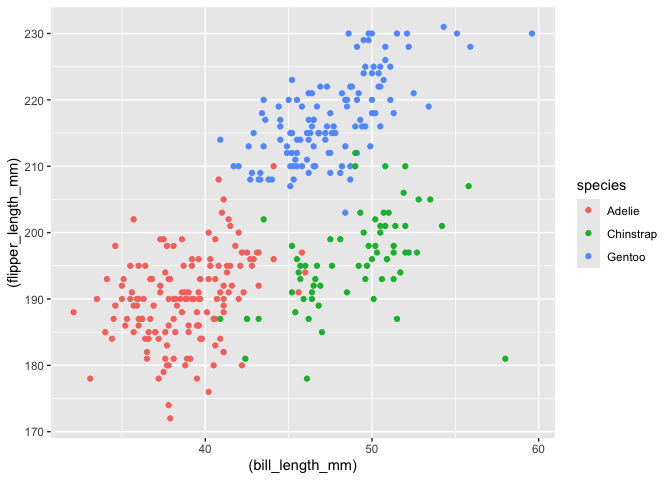

p8105_hw1_fs2968
================

``` r
#Loading necessary library and database
library(tidyverse) 
```

    ## ── Attaching core tidyverse packages ──────────────────────── tidyverse 2.0.0 ──
    ## ✔ dplyr     1.2.1     ✔ readr     2.2.0
    ## ✔ forcats   1.0.1     ✔ stringr   1.6.0
    ## ✔ ggplot2   4.0.3     ✔ tibble    3.3.1
    ## ✔ lubridate 1.9.5     ✔ tidyr     1.3.2
    ## ✔ purrr     1.2.2     
    ## ── Conflicts ────────────────────────────────────────── tidyverse_conflicts() ──
    ## ✖ dplyr::filter() masks stats::filter()
    ## ✖ dplyr::lag()    masks stats::lag()
    ## ℹ Use the conflicted package (<http://conflicted.r-lib.org/>) to force all conflicts to become errors

``` r
data("penguins", package = "palmerpenguins")
```

# Problem 1, Penguin Dataset Summary

The penguin dataset available with the palmerpenguins package describes
8 different characteristics of penguins for a total of 344 penguins.
These characteristics are measured in different ways as well. The
species of penguin, the island of origin, and sex are categorical
variables with values like Adelie, Torgersen, and female respectively.
The bill length and depth are measured as doubles to the first decimal
place. Lastly, flipper length, body mass index, and year are measured as
integers. We can do some simple statistics with this data set to gain
insight on our sample population, like calculating the mean of the
penguins flipper length after removing NA values: 200.9152047.

# Plotting Data

Here, we can plot some of our data to help visualize it. For example,
below we plot bill length vs flipper length:

``` r
#Creating a separate database with removed na values
penguins_plot <- penguins |> 
  drop_na(bill_length_mm, flipper_length_mm)
#Plotting 2 columns of data in a scatter plot, colored by species
ggplot(penguins_plot, aes(x = bill_length_mm, y = flipper_length_mm, color=species)) + geom_point()
```

<!-- -->

``` r
ggsave("scatterplot.pdf")
```

    ## Saving 7 x 5 in image

In the graph above, we have bill length on the x-axis and flipper length
on the y-axis, showing the relation of these two characteristics
color-differentiated by species. We can observe that the Adelie Penguins
on average have the small flipper length and small bill length, the
Chinstrap penguins have small flipper length but much larger bill
length, and Gentoo penguins have large flipper length and large bill
length.

# Problem 2, Building dataframe

We create a dataframe with a random sample of length 10 from a normal
distribution, a logical vector that maps the function, greater than 0,
onto the random sample, a character vector with letters a through k, and
a factor vector with repeated low, medium, and high values (we specify
it to be length 10, so the last element is low).

After creating this dataframe, we take the mean of each vector/list. We
are able to successfully take the mean for the first two vectors, but
the last two return NA. The reason that taking the mean of the first two
vectors work is because they are numeric lists, with the first being
real numbers and the second being boolean values that map to 0 and 1.
The second two lists don’t have a mean because they are both values that
cannot be natively mapped to number values.

``` r
#Creating a data frame for the vectors defined in the problem
df = tibble(
  rand_sample = rnorm(10),
  log_vec = rand_sample > 0,
  char_vec = c("a","b","c","d","e","f","g","h","i","k"),
  factor_vec = factor(rep(c("low", "medium", "high"), length.out= 10))
)

#Taking the mean of each vector
mean_out <- c(mean(pull(df, rand_sample)), mean(pull(df, log_vec)), mean(pull(df, char_vec)), mean(pull(df, factor_vec)))
```

    ## Warning in mean.default(pull(df, char_vec)): argument is not numeric or
    ## logical: returning NA

    ## Warning in mean.default(pull(df, factor_vec)): argument is not numeric or
    ## logical: returning NA

``` r
#Printing out the results
mean_out 
```

    ## [1] 0.1350431 0.6000000        NA        NA

To transform the data type of the last three lists into numerical values
where the mean can be taken, we can use the as.numeric function.

``` r
#Transforming the last 3 vectors into numeric (attempt)
as.numeric(pull(df, log_vec))
as.numeric(pull(df, char_vec))
as.numeric(pull(df, factor_vec))
```

However, using the as.numeric function only transforms the logical
vector and the factor vector into numerical values, while the character
vector continues to return NA. This implies that since the logical
vector has number values for True and False and the factor vector can be
transformed into a numerical order, those two lists can be represented
numerically. Unfortunately, the character vector cannot be transformed
in such a way, so it continues to be NA.
